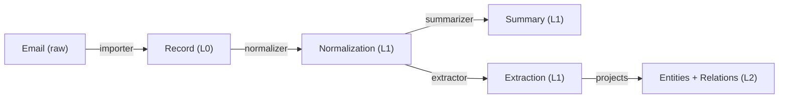

# RankeDB Workers: Building a Semantic Graph from Raw Data

## Abstract

We demonstrate how a pipeline of independent workers — both mechanistic and LLM-assisted — transforms raw data into a provenance-complete semantic knowledge graph on the RankeDB platform. Starting from unstructured inputs (email archives, chat transcripts), we trace the full path through ingestion, normalization, summarization, and entity extraction to a navigable semantic graph where every node and edge is traceable to its source. Workers are stateless processes that interact with RankeDB exclusively through its API, identified by run IDs, producing append-only Thoughts with full provenance. The pipeline validates RankeDB's core architectural claim: that Level 2 (semantic graph) is a materialized view of Level 1 (provenance DAG), grounded in Level 0 (raw sources).

## 1. Introduction

- Paper 1 defines the database; this paper fills it
- The challenge: from unstructured data to structured knowledge, with provenance at every step
- Why workers are not plugins or modules but independent processes against an API
- Goal: end-to-end demonstration with real data (email, chat exports)

### 1.1 Design Goals

The worker pipeline is designed to produce a populated RankeDB stack that supports the **five core long-term memory abilities** identified by Wu et al. (2025, *LongMemEval*, ICLR 2025, arXiv 2410.10813v2). We adopt their definitions verbatim as design goals for the worker fleet:

- **Information Extraction (IE).** *"Ability to recall specific information from extensive interactive histories, including the details mentioned by either the user or the assistant."*
  → **Worker requirement:** extractors must capture facts stated by *either* party in a dialogue, with high enough fidelity that the exact content can be reconstructed. Summaries that drop either the user or the assistant side fail this goal.

- **Multi-Session Reasoning (MR).** *"Ability to synthesize information across multiple history sessions to answer complex questions that involve aggregation and comparison."*
  → **Worker requirement:** extractors must produce Thoughts that survive aggregation across sessions — stable entity IDs, resolvable aliases, and typed relations that a downstream agent can count, compare, and intersect. This is where the RankeDB stack is expected to have its clearest structural advantage (Paper 3 §7.3), and the worker fleet must not undermine it by over-summarizing within a session.

- **Knowledge Updates (KU).** *"Ability to recognize the changes in the user's personal information and update the knowledge of the user dynamically over time."*
  → **Worker requirement:** when new information contradicts existing Thoughts, the worker must *append* a superseding Thought with correct temporal bounds and provenance — not mutate or overwrite. The append-only property is enforced by the database (Paper 1 §3.2), but the worker must emit the right shape of update.

- **Temporal Reasoning (TR).** *"Awareness of the temporal aspects of user information, including both explicit time mentions and timestamp metadata in the interactions."*
  → **Worker requirement:** every extracted Thought must carry temporal metadata from two sources: the timestamp of the source Record (always available) and any explicit time expressions in the content (parsed out during extraction). Both kinds of time are propagated to L2 edges as `valid_from`/`valid_until`.

- **Abstention (ABS).** *"Ability to identify questions seeking unknown information, i.e., information not mentioned by the user in the interaction history, and answer 'I don't know.'"*
  → **Worker requirement:** extractors must not hallucinate. A Thought must only exist if the source material actually supports it. Correct abstention at the agent level (Paper 3) depends on correct non-production at the worker level — if the extractor invents entities, no downstream abstention policy can recover.

These five goals are the rubric we evaluate the worker pipeline against in §6. They are also the lens through which we make design decisions throughout the paper: every choice about normalization granularity, extraction style, entity resolution strategy, and temporal metadata is a choice about which of these abilities the pipeline is better or worse at supporting.

## 2. Worker Architecture

### 2.0 The Contract: S3 as Decoupling Point

Before discussing individual workers, one design principle shapes the entire pipeline: **ingest workers and RankeDB are decoupled through Level 0 and know nothing about each other.** Ingest workers know how to talk to S3; they do not know what RankeDB is, where Postgres lives, or what happens to their outputs downstream. RankeDB knows how to read from S3; it does not know which worker produced any particular Record or how that worker was scheduled. The only contract between them is the Level 0 storage format: a SHA-256 content hash as the object key, and the metadata header schema defined in Paper 1 §4.1.1.

This decoupling is what makes the ingest fleet extensible. A new source of data (a new chat provider, a new device, a new document export format) requires writing a new ingest worker against the S3 contract — nothing in RankeDB itself changes. Conversely, replacing the RankeDB backend (schema changes, storage engine swaps) does not require touching any ingest worker, because none of them knows it exists. Level 0 is a dumb, stable collection point by design.

Later workers in the pipeline — normalizers, summarizers, extractors — do interact with the RankeDB API directly, because their job is to produce Thoughts with provenance. But even they are clients of a stable contract, not components of RankeDB itself.

### 2.1 Worker Anatomy

- Stateless: no internal memory between runs
- Identified by run ID (links all outputs of a single execution)
- Reads from API (Records, existing Thoughts), writes to API (new Thoughts)
- Tool and config metadata recorded on provenance edges
- DAG-query pattern: "find Records/Thoughts in state X without state Y"

### 2.2 Mechanistic vs. LLM-Assisted Workers

- Mechanistic: deterministic, reproducible (format conversion, deduplication, parsing)
- LLM-assisted: non-deterministic, contingent on model/prompt/version (summarization, extraction, classification)
- RankeDB treats both identically — provenance tracks the difference
- Same Record processed by both: competing Thoughts coexist

### 2.3 Worker Orchestration

- No central orchestrator — workers discover work via DAG queries
- Self-healing: crashed workers leave incomplete chains, next run picks up
- Ordering via dependency: summarizer waits for normalizer output (implicit, not scheduled)

### 2.4 Quality Over Speed: The Inference-Cost Bet

Workers are designed for **extraction quality first, throughput second.** When the two conflict, we prefer the slower pipeline that preserves more structure, more context, and more ambiguity over the faster pipeline that forces early commitments. Concretely, this means: we run the better (larger, slower) model when a choice exists, we keep intermediate representations that a faster pipeline would discard, we tolerate LLM latencies that would be prohibitive in an interactive loop, and we accept redundant work (multiple extractors, multiple summarizers) when it produces a richer provenance record.

This is a deliberate bet on the same trajectory that Paper 1 §7.1 bets on at the data-model level: **LLM inference is getting faster and cheaper by orders of magnitude per year, and will continue to.** A worker pipeline tuned for quality at 2026 inference cost becomes a fast pipeline at 2028 inference cost without any changes to the pipeline itself. A pipeline tuned for speed at 2026 cost by discarding structure can never recover what it threw away, because the raw Records it worked from are still in Level 0 but the structural decisions it made along the way are lost.

The symmetry with Paper 1 is deliberate: RankeDB bets that **context windows will grow**, workers bet that **inference throughput will grow**, and both bets discharge into the same design principle — *accumulate everything, consolidate nothing*. The cost of being wrong on either bet is storage and compute spent on history that cannot be utilized. The cost of being right is that a future model receives the full derivation history and structural richness of a belief rather than a lossy summary.

This bet does not apply to the Level 0 layer (ingest workers are mechanistic and already fast) or to deterministic parsing steps (LiteParse, format conversion, deduplication). It applies specifically to **LLM-assisted extraction, entity resolution, and summarization** — the places where a quality/speed tradeoff exists and where slower models produce meaningfully better output.

## 3. The Ingestion Pipeline

### 3.1 Importers (Level 0)

Importers are the workers that populate Level 0. Each one targets a single source and produces raw Records in the object store, content-addressed by SHA-256 with routing metadata (see Paper 1 §4.1.1). They are mechanistic — no LLM in the loop — and idempotent: re-running an importer over the same input is a no-op because the content-addressed `PUT` will either hit an existing key or write a new one. No duplicate detection logic is needed above the storage layer.

The reference deployment runs the following importers:

| Importer | Source | Mechanism |
|---|---|---|
| **Zoho Mail** | Zoho IMAP | Polls a dedicated `rankedb` folder; writes each message as an `.eml` Record |
| **Google Photos** | Google Photos API | Export / sync of original assets into Level 0 |
| **Android Share** | Android app | Direct upload via share intent from any app on the device |
| **Paperless** | Paperless-ngx export | Scanned and OCR-processed documents |
| **Chat exports** | ChatGPT / Claude export | One Record per conversation |

Further importers can be added without touching RankeDB or the existing fleet — they are independent processes that share only the Level 0 contract. Importers hold write-only S3 credentials (`s3:PutObject` + `s3:ListBucket`) and have no read access to the archive they are feeding. This enforces the decoupling from §2.0 at the credential level: a compromised importer cannot exfiltrate anything, and an importer cannot accidentally grow into an RankeDB-aware component.

### 3.2 Normalizer (Level 0 → Level 1)

The normalizer's job is to turn a raw Record into clean structured content: HTML email into plain text, a JSON chat export into a conversation transcript, a PDF into paginated text with layout preserved. It is a mechanistic worker and produces Thoughts of type `normalization` with provenance to the source Record.

For documents, the reference implementation delegates parsing to **LiteParse** (LlamaIndex), which fits the design constraints well: it is TypeScript/Node.js (same runtime as the rest of the worker fleet), it runs locally without a cloud dependency, and it handles PDF natively plus Office formats via LibreOffice conversion and images via ImageMagick. LiteParse performs spatial text parsing — preserving layout rather than collapsing to error-prone Markdown — has built-in OCR (Tesseract.js), and can optionally produce per-page screenshots for multimodal reasoning downstream.

LiteParse is deployed as a **stateless API service** on Hetzner/Coolify. It is pure compute with no persistent state: the RankeDB backend sends it a blob and receives extracted text plus metadata in response. LiteParse never sees where the data lives or where the results go.

```
RankeDB backend
  │
  │  POST /parse (blob + bearer token)
  ▼
LiteParse API
  │
  │  Response: extracted text + metadata
  ▼
RankeDB backend → Postgres (normalization Thought)
```

Because LiteParse holds no state, losing or replacing it is a cosmetic event — the parsing is deterministic and can be re-run at any time from the source Record. It is an implementation choice, not part of the RankeDB data model.

- **References:** [LiteParse announcement](https://www.llamaindex.ai/blog/liteparse-local-document-parsing-for-ai-agents) · [github.com/run-llama/liteparse](https://github.com/run-llama/liteparse)

### 3.3 Summarizer (Level 1 → Level 1)

- LLM-assisted: produces concise summary of normalized content
- Thought of type "summary" with provenance to normalization Thought
- Model version, prompt template recorded in provenance metadata
- Multiple summarizers can run over same input — results coexist

### 3.4 Entity Extractor (Level 1 → Level 1 + Level 2)

- LLM-assisted: identifies entities (people, projects, concepts, tools) and relations
- Produces Thoughts of type "extraction" in Level 1
- Projects entities and relations into Level 2 (FalkorDB)
- Natural-language relation labels, unique edge IDs, temporal validity, confidence scores
- Every Level 2 node and edge has provenance reference to Level 1 extraction Thought

> **TODO — Reading for §3.4 (LLM-driven KG construction landscape):**
>
> *PDF1's §5 "GraphRAG's deterministic retrieval" and §7 "LLM-driven KG construction" are the primary sources here. The field has exploded since April 2024.*
>
> - **Edge et al. (April 2024). "From Local to Global: A Graph RAG Approach to Query-Focused Summarization."** Microsoft Research. Foundational GraphRAG paper. Entity/relation extraction via LLMs + Leiden community detection + community summaries. Enables "global" queries that vector RAG cannot answer. weaviate.io/blog/graph-rag. `read.pdf`. **Priority: H.**
> - **DRIFT Search (Microsoft, October 2024).** Global + local retrieval with iterative refinement. microsoft.com/en-us/research/blog/introducing-drift-search. `read.pdf`. **Priority: M.**
> - **LazyGraphRAG (Microsoft, November 2024).** Reduces indexing costs to **0.1% of full GraphRAG** via NLP-based extraction instead of LLM summarization. lianpr.com/en/news/detail/3224. `read.pdf`. **Priority: M.**
> - **LightRAG (EMNLP 2025).** Entity deduplication merges identical entities with **no history preservation**. lightrag.github.io. *Cite as destructive counter-example.* `read.pdf`. **Priority: M.**
> - **EDC Framework (Zhang & Soh 2024).** Canonicalization phase consolidates schema components — contrast with RankeDB's emergent ontology. `read.pdf`. **Priority: L.**
> - **iText2KG / ATOM (AuvaLab 2025).** Dual-time modeling preserves temporal metadata but performs entity merging. github.com/AuvaLab/itext2kg. `read.pdf`. **Priority: M.**
> - **Graphiti (Zep, arXiv 2501.13956, January 2025).** **Must read.** Three-layer architecture paralleling RankeDB; achieved **94.8% on DMR benchmark**, **300ms P95** retrieval latency. Uses same graph DBs RankeDB specifies (FalkorDB or Neo4j). But performs destructive entity summary updates. `read_2.pdf` + `read.pdf`. **Priority: H — the single closest comparison for RankeDB workers.**
> - **Neo4j GraphRAG Python package.** Aug 2025 **ToolsRetriever** is closest precedent for Stacker-style selection (LLM-mediated). neo4j.com/blog/developer/introducing-toolsretriever-graphrag-python-package. `read.pdf`. **Priority: H — bridges to Paper 4.**
> - **LlamaIndex Property Graph Index.** Concurrent retrievers (LLMSynonymRetriever, VectorContextRetriever, CypherTemplateRetriever). llamaindex.ai/blog/introducing-the-property-graph-index. `read.pdf`. **Priority: M.**
> - **Adaptive RAG (Jeong et al. 2024).** Classifier-based complexity routing. `read.pdf`. **Priority: L.**

### 3.5 The Full Chain



- Every arrow is a provenance edge with tool attribution
- Every node is immutable and append-only
- The Graph Explorer can trace any L2 entity back through this chain to the original email

## 4. Entity Resolution and Disambiguation

- Same person mentioned differently across sources ("F. Noël", "Florian", "flo@...")
- Alias resolution as a worker: produces "merge" Thoughts with confidence levels
- Not destructive — original extractions remain, merge is an overlay
- Context-dependent: "RankeDB" the project vs. "RankeDB" the mythological figure
- Uncertainty as first-class data: conviction scores on entity identity

> **TODO — Reading for §4 (entity resolution tradition from 1969 to 2025):**
>
> *PDF1 §3 is the primary source. RankeDB's conviction-scored entity resolution extends a 55-year tradition. Each of these systems contributes one piece — no one combines them as RankeDB proposes.*
>
> - **Fellegi & Sunter (1969). "A Theory for Record Linkage."** *Journal of the American Statistical Association.* Foundational paper. Established the **three-way classification: automatic link / automatic non-link / clerical review.** The original "manual confirmation threshold." **Direct ancestor of RankeDB's conviction thresholds.** `read.pdf`. **Priority: H.**
> - **Splink (UK Ministry of Justice, open-source).** Reference implementation of Fellegi-Sunter with configurable match-weight thresholds on Spark/DuckDB backends, supports millions of records. robinlinacre.com/introducing_splink. `read.pdf`. **Priority: M.**
> - **Senzing (Jeff Jonas, $50M+ invested).** **Entity Centric Learning** — as new data arrives, the system revisits previous decisions in real time. Built-in explainability with *"why, why not, and how"* functions. **Closest parallel to RankeDB's "case law" concept.** senzing.com/how-entity-resolution-works-with-senzing; senzing.com/explainability. `read.pdf`. **Priority: H — the case-law concept has a direct commercial precedent.**
> - **Dedupe (Forest Gregg / based on Bilenko PhD work).** Uses active learning where human labels train the model. github.com/dedupeio/dedupe. Requires upfront batch labeling — RankeDB's case law is more continuous. `read.pdf`. **Priority: M.**
> - **Bayesian ER approaches (SMERED line).** MCMC with split-merge updates propagating full posterior uncertainty. **Most principled uncertainty quantification available, but rarely implemented in production.** minimalistinnovation.co/post/why-probabilistic-record-linkage-still-matters. `read.pdf`. **Priority: L.**
> - **CORE-KG (2025).** Legal document KG system performing contextual entity resolution that **explicitly avoids spurious merging**, preserving distinctions between surface-similar mentions. `read.pdf`. **Priority: L.**
> - **Terminology note from PDF1:** *The term "conviction" itself appears novel — no other system uses this specific terminology, with alternatives including "match probability," "match weight," and "posterior probability." The epistemic framing ("conviction" implies accumulated evidence) rather than statistical framing ("probability" implies frequency-based estimation) is a meaningful conceptual distinction.* **Make this terminology distinction explicit in §4.** **Priority: M.**
> - **Where RankeDB genuinely innovates (PDF1):** *embedding alias resolution as first-class graph relationships.* Most systems use flat lookup tables for aliases (JIM = JAMES). RankeDB's IS_ALIAS semantic edges with conviction levels and full provenance represent a richer model. **Priority: M.**

## 5. Reprocessing

- New model available → run new extractor over existing Records
- Old and new extractions coexist in Level 1
- Level 2 view configurable: prefer latest worker, highest confidence, or specific version
- No migration, no data loss, no downtime
- Practical demonstration: same emails processed by two different LLMs, results compared in Explorer

> **TODO — Reading for §5 (reprocessing as append — contrast with destructive systems):**
>
> *This section's whole point is the contrast. PDF1 §7 (LLM-driven KG construction) gives you the explicit landscape of what RankeDB refuses.*
>
> - **Graphiti/Zep (arXiv 2501.13956).** Partial immutability via fact invalidation, but **destructive entity summary updates**. Closest system that still fails the full test. `read_2.pdf`. **Priority: H.**
> - **Microsoft GraphRAG.** Community summaries are **regenerated**, replacing old versions; extraction is not fully reproducible. weaviate.io/blog/graph-rag; microsoft.com/en-us/research/blog/graphrag-unlocking-llm-discovery. `read.pdf`. **Priority: M.**
> - **LightRAG (EMNLP 2025).** Entity deduplication with **no history preservation**. lightrag.github.io. `read.pdf`. **Priority: M.**
> - **EDC Framework (Zhang & Soh 2024).** Canonicalization phase explicitly consolidates schema. `read.pdf`. **Priority: L.**
> - **Google Always-On Memory Agent (March 2026).** **ConsolidateAgent runs every 30 minutes**, merges duplicates and drops information. digit.in/features/general/googles-new-ai-agent-remembers-everything. *RankeDB's explicit opposite — cite as the anti-design.* `read.pdf`. **Priority: H.**
> - **PDF1 summary quote:** *"No existing system matches RankeDB's full specification: add-only storage, content-addressable immutable raw sources, no destructive consolidation, conviction-based entity resolution instead of hard merges, and complete inferential history preservation. RankeDB's commitment to immutability is more extreme than any published system."* **Use verbatim as §5 closing.**

## 6. Evaluation

### 6.1 Extraction test fixtures: LongMemEval scenarios

The seven question-type scenarios in Figure 1 of LongMemEval (Wu et al., ICLR 2025; arXiv 2410.10813v2) are well-suited as test fixtures for the extraction worker pipeline. Each scenario is a short, self-contained dialogue fragment that exercises a specific aspect of fact extraction and graph construction — together they cover the capabilities a competent extractor must support. We adopt them as qualitative test cases for evaluating the extractor and for visualizing the semantic graph a scenario produces.

Mapping each LongMemEval question type to the extraction capability it exercises:

| LongMemEval question type | Extraction capability under test |
|---|---|
| **single-session-user** | Extract user-stated facts as Thoughts with provenance to the utterance. *(Example: "my commute takes 45 minutes each way")* |
| **single-session-assistant** | Extract assistant-produced facts as Thoughts. *The assistant's own statements are first-class knowledge; a restaurant it recommended yesterday is a fact the user can ask about tomorrow.* |
| **single-session-preference** | Infer latent attributes (brand affinity, recurring constraints) from multiple signals in one session. Preferences are Thoughts with lower conviction than direct statements and carry provenance to every signal that supports them. |
| **temporal-reasoning** | Extract facts with explicit timestamps (`valid_from`) and produce L2 edges that can answer span-based queries. Requires that the extractor attach the utterance timestamp to every extracted entity. |
| **knowledge-update** | Produce a new Thought that supersedes an earlier one without deleting it. The append-only model from Paper 1 §3.2 handles this at the data layer; the extractor's job is to recognize the update and emit the supersession correctly, not to mutate. |
| **multi-session** | Aggregate facts across multiple independent sessions. **The scenario on which the RankeDB stack is expected to shine**, because the data model does not privilege sessions as a primary unit: cross-session unification is a direct property of L2 entity resolution (§4), not a post-hoc query pattern. Still requires that resolution correctly avoids spurious merging. |
| **abstention** | Produce no false facts. The extractor must not hallucinate entities that were never mentioned — the absence of a Thought is the correct behavior. Evaluated by negative tests: after running the extractor, the graph must not contain claims the dialogue never supported. |

### 6.2 Presenting extraction results as semantic graphs

For each LongMemEval scenario, we intend to present the semantic graph that results from running the raw dialogue through the worker pipeline: importer → normalizer → extractor → L1 Thoughts → L2 projection. The visualization makes the pipeline's behavior concrete and inspectable. A single scenario produces a small enough graph to render fully (~5–30 nodes, ~10–50 edges) while exercising the full chain of provenance from a Level 2 entity back to the raw Record.

This serves three purposes:

- **Qualitative ground truth.** A reader can see directly whether the extractor captured the relevant facts, whether entity resolution unified the right mentions, and whether temporal edges carry the right timestamps.
- **Provenance-chain walkthrough.** Each extracted entity traces back through the pipeline to the source utterance. This makes Paper 1's "provenance as substrate" claim tangible.
- **Failure mode visibility.** When the extractor gets something wrong, the graph makes the error obvious — a missing entity, a spurious edge, a mis-resolved alias. These become concrete case studies for §7 Discussion.

The scenario graphs are qualitative; they do not substitute for the end-to-end benchmark evaluation in Paper 3, which measures chat-assistant accuracy on the full LongMemEval question set.

### 6.3 Quantitative metrics

Beyond the qualitative scenario walkthroughs, we report:

- **Provenance completeness.** Fraction of L2 nodes and edges with an unbroken provenance chain to a Level 0 Record. Target: 100%. Any value below 100% indicates a bug in the pipeline.
- **Extraction recall per question type.** For each of the seven LongMemEval question types, the fraction of relevant facts present in the semantic graph after extraction, computed against hand-annotated ground truth on a held-out subset of scenarios.
- **Entity resolution correctness.** On scenarios that contain cross-session references to the same entity, the fraction of mentions correctly unified. Errors split into *missed merges* (same entity, not unified) and *spurious merges* (different entities, incorrectly unified — expected to be near zero due to the contextual resolution of §4).
- **Reprocessing cost.** Time to rerun the full extractor over an existing L0 corpus and produce a second generation of Thoughts. Measures the operational cost of the "reprocessing is an append operation" property from §5.
- **Hallucination rate.** For abstention-type scenarios, fraction of extracted entities that are not supported by the source dialogue. Target: zero.

We deliberately do not optimize for extraction latency in this paper. Per §2.4, the worker design is a bet on falling LLM inference costs; throughput will be reported for context but is not a primary metric.

## 7. Discussion

- What the pipeline reveals about RankeDB's architecture
- Worker failure modes and recovery
- Cost considerations: LLM calls per Record, storage growth
- Limits of current approach, open questions for future workers

## 8. Conclusion

- The semantic graph is not curated — it is grown
- Workers are the mechanism, provenance is the record
- RankeDB + workers = a complete knowledge system, no manual curation required

## References

*TBD — will reference Paper 1 and relevant extraction/NLP literature*

---

*Skeleton v0.1 — April 2026*
